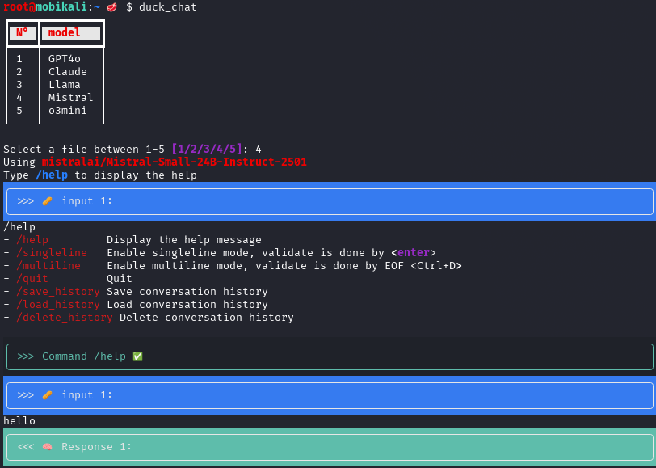
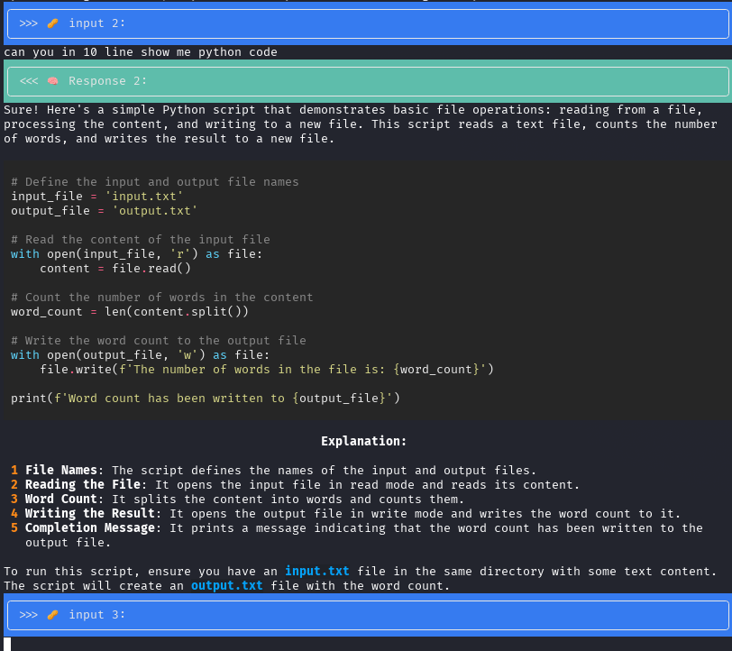

# A DuckDuckGo AI chat client written in python

A python-implemented DuckDuckGo AI chat client with model selection and dialog history during usage. 

> Based on the ideas of [duck-hey](https://github.com/b1ek/hey)

## Disclaimer
By using this client you accept [DuckDuckGo AI Chat ToS](https://duckduckgo.com/aichat/privacy-terms)

## Installation via curl
```bash 
curl https://raw.githubusercontent.com/toniok2nd/duck_chat/refs/heads/main/install.sh | sudo bash"
source /etc/profile.d/duck_aliases.sh
```

## Uninstall via curl
```
curl https://raw.githubusercontent.com/toniok2nd/duck_chat/refs/heads/main/uninstall.sh | sudo bash"
```

## Usage
- Using terminal
```bash
duck_chat
```





> P.S. You can use hey config ```".config/hey/conf.toml"``` Thanks [k-aito](https://github.com/mrgick/duckduckgo-chat-ai/pull/1)


- Using as library
```py
import asyncio
from duck_chat import DuckChat

async def main():
    async with DuckChat() as chat:
        print(await chat.ask_question("2+2?"))
        await asyncio.sleep(1)
        print(await chat.ask_question("6+6?"))

asyncio.run(main())
```
